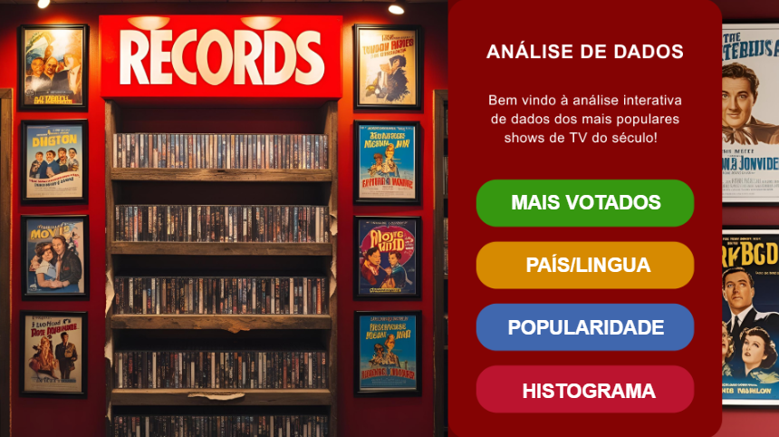
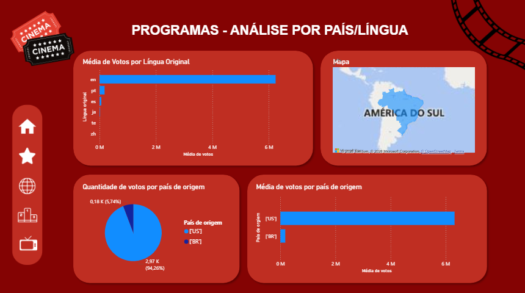
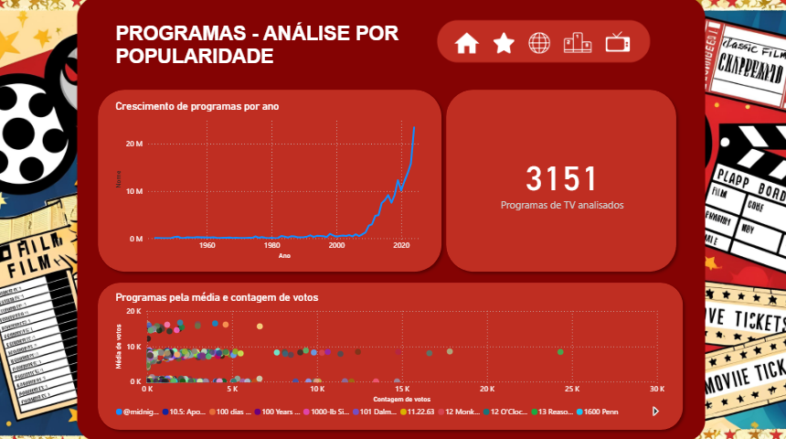
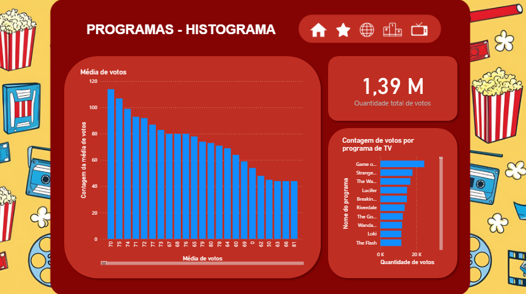

Dashboard de Análise de Programas de TV

Dashboard interativo desenvolvido no Power BI para análise de popularidade, votação e distribuição de programas de TV. O projeto explora padrões de audiência e métricas de popularidade a partir de um conjunto de dados estruturado.

Projeto desenvolvido em colaboração com Isabella Moura, utilizando divisão de tarefas para modelagem de dados, construção dos dashboards e validação dos resultados.

Classificado em 1º lugar entre os projetos da turma, em atividade avaliativa focada em análise e visualização de dados.

Objetivo:
Transformar dados brutos sobre programas de TV em informações visuais que permitam identificar:
- Programas mais populares
- Tendências de crescimento ao longo dos anos
- Distribuição de votos por país e idioma
- Comportamento estatístico das avaliações

Tecnologias utilizadas:
- Power BI
- Modelagem de dados
- Visualização interativa
- Análise exploratória de dados

Funcionalidades do dashboard:
- Ranking de programas mais votados
- Análise por país e idioma
- Evolução de popularidade ao longo do tempo
- Distribuição estatística das avaliações

Prévia do dashboard:

Projeto desenvolvido por:
Maria Eduarda Geronimo  
Isabella Moura
